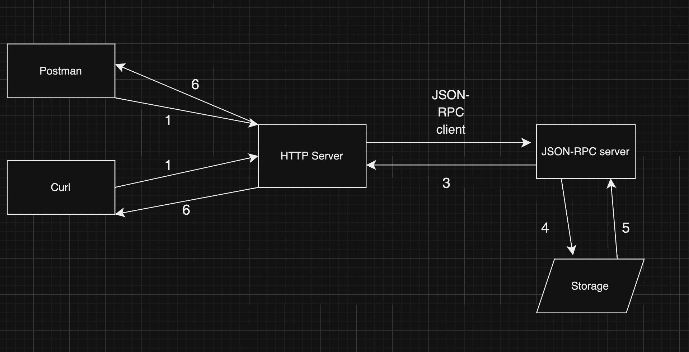

## Uy vazifa

1. ### Users larni REST API microservice yarating.
2. ### User `GET`, `POST`, `PUT` va `DELETE` endpoint ichida `JSON-PRC` Client or'qali ma'lumotla yuborilsin   
3. ### Har bir client ga `random` request ID yarating. Batafsil ma'lumot [link](https://github.com/ybbus/jsonrpc/) 
4. ### `JSON-PRC` Serverda tepadagi method larni qo'shib chiqing 
5. ### `Storage` uchan ihtiyoriy narsa ishlatishiz mumkun

